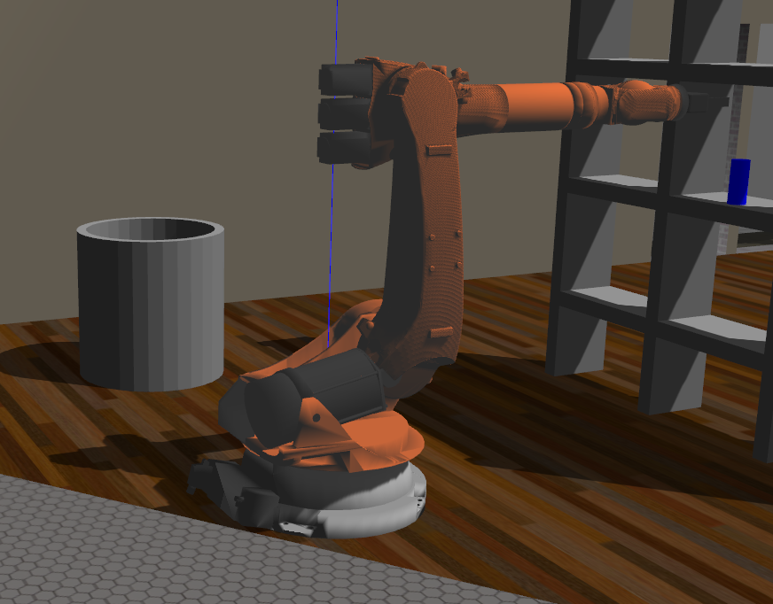

[](https://www.udacity.com/robotics)
# Robotic arm - Pick & Place project

## KUKA KR210 Robotics Arm

[//]: # (Image References)
[image0]: ./misc_images/kuka_kr210.png
[image1]: ./misc_images/individual_matrices_drawing.jpg
[image2]: ./misc_images/joints_and_links_drawing.jpg
![alt text][image0] 

Make sure you are using robo-nd VM or have Ubuntu+ROS installed locally.

### One time Gazebo setup step:
Check the version of gazebo installed on your system using a terminal:
```sh
$ gazebo --version
```
To run projects from this repository you need version 7.7.0+
If your gazebo version is not 7.7.0+, perform the update as follows:
```sh
$ sudo sh -c 'echo "deb http://packages.osrfoundation.org/gazebo/ubuntu-stable `lsb_release -cs` main" > /etc/apt/sources.list.d/gazebo-stable.list'
$ wget http://packages.osrfoundation.org/gazebo.key -O - | sudo apt-key add -
$ sudo apt-get update
$ sudo apt-get install gazebo7
```

Once again check if the correct version was installed:
```sh
$ gazebo --version
```
### For the rest of this setup, catkin_ws is the name of active ROS Workspace, if your workspace name is different, change the commands accordingly

If you do not have an active ROS workspace, you can create one by:
```sh
$ mkdir -p ~/catkin_ws/src
$ cd ~/catkin_ws/
$ catkin_make
```

Now that you have a workspace, clone or download this repo into the **src** directory of your workspace:
```sh
$ cd ~/catkin_ws/src
$ git clone https://github.com/udacity/RoboND-Kinematics-Project.git
```

Now from a terminal window:

```sh
$ cd ~/catkin_ws
$ rosdep install --from-paths src --ignore-src --rosdistro=kinetic -y
$ cd ~/catkin_ws/src/RoboND-Kinematics-Project/kuka_arm/scripts
$ sudo chmod +x target_spawn.py
$ sudo chmod +x IK_server.py
$ sudo chmod +x safe_spawner.sh
```
Build the project:
```sh
$ cd ~/catkin_ws
$ catkin_make
```

Add following to your .bashrc file
```
export GAZEBO_MODEL_PATH=~/catkin_ws/src/RoboND-Kinematics-Project/kuka_arm/models

source ~/catkin_ws/devel/setup.bash
```

For demo mode make sure the **demo** flag is set to _"true"_ in `inverse_kinematics.launch` file under /RoboND-Kinematics-Project/kuka_arm/launch

In addition, you can also control the spawn location of the target object in the shelf. To do this, modify the **spawn_location** argument in `target_description.launch` file under /RoboND-Kinematics-Project/kuka_arm/launch. 0-9 are valid values for spawn_location with 0 being random mode.

You can launch the project by
```sh
$ cd ~/catkin_ws/src/RoboND-Kinematics-Project/kuka_arm/scripts
$ ./safe_spawner.sh
```

If you are running in demo mode, this is all you need. To run your own Inverse Kinematics code change the **demo** flag described above to _"false"_ and run your code (once the project has successfully loaded) by:
```sh
$ cd ~/catkin_ws/src/RoboND-Kinematics-Project/kuka_arm/scripts
$ rosrun kuka_arm IK_server.py
```

### Forward Kinematic Analysis

'kr210.urdf.xacro' specify the joints and links of the KR210 robotics arm.

No. | joint | parent | child | x | y | z | r | p | y |
--- | --- | --- | --- | --- | --- | --- | --- | --- | --- |
0 | fixed_base | base_footprint | base_link | 0 | 0 | 0 | 0 | 0 | 0 |
1 | joint_1 | base_link | link_1 | 0 | 0 | 0.33 | 0 | 0 | 0 |
2 | joint_2 | link_1 | link_2 | 0 .35| 0 | 0.42 | 0 | 0 | 0 |
3 | joint_3 | link_2 | link_3 | 0 | 0 | 1.25 | 0 | 0 | 0 |
4 | joint_4 | link_3 | link_4 | 0.96 | 0 | -0.054 | 0 | 0 | 0 |
5 | joint_5 | link_4 | link_5 | 0.54 | 0 | 0 | 0 | 0 | 0 |
6 | joint_6 | link_5 | link_6 | 0.193 | 0 | 0 | 0 | 0 | 0 |
7 | gripper | link_6 | gripper_link | 0.11 | 0 | 0 | 0 | 0 | 0 |
- | **Total (m)** | - | - | **2.153** | 0 | **1.946** | 0 | 0 | 0 |

#### Specify the joints and links

![alt text][image2] 

#### Kuka KR210 robotics arm DH paramters

Links | i | alpha(i-1) | a(i-1) | d(i) | theta(i) |
:---: | :---: | :---: | :---: | :---: | :---: |
0->1 | 1 | 0 | 0 | 0.75 | q1 |
1->2 | 2 | -90 | 0.35 | 0 | -90+q2 |
2->3 | 3 | 0 | 0 | 1.25 | q3 |
3->4 | 4 | -90 | -0.0054 | 1.5 | q4 |
4->5 | 5 | 90 | 0 | 0 | q5 |
5->6 | 6 | -90 | 0 | 0 | q6 |
6->7 | 7 | 0 | 0 | 0.303 | q7 |

#### Individual Transform Matrices

![alt text][image1] 

### Inverse Kinematics

#### Joint 1 to 3

```python
theta1 = atan2(wc[1], wc[0]) 
```

```python
# SSS triangle for theta2 and theta3
side_a = 1.501
side_b = sqrt(pow((sqrt(wc[0] * wc[0] + wc[1] * wc[1]) - 0.35), 2) + pow((wc[2] - 0.75), 2))
side_c = 1.25

# Find each side of angle using cosine rule
angle_a = acos((side_b * side_b + side_c * side_c - side_a * side_a) / (2 * side_b * side_c))
angle_b = acos((side_a * side_a + side_c * side_c - side_b * side_b) / (2 * side_a * side_c))
angle_c = acos((side_a * side_a + side_b * side_b - side_c * side_c) / (2 * side_a * side_b)) 

theta2 = pi / 2 - angle_a - atan2(wc[2] - 0.75, sqrt(wc[0] * wc[0] + wc[1] * wc[1]) - 0.35)
```

```python
theta3 = pi / 2 - (angle_b + 0.036) # 0.036 accounts for sag in link4 of -0.054m
```

#### Joint 4 to 6
```python
R0_3 = T0_1[0:3, 0:3] * T1_2[0:3, 0:3] * T2_3[0:3, 0:3]
R0_3 = R0_3.evalf(subs={q1: theta1, q2: theta2, q3: theta3})

R3_6 = R0_3.inv("LU") * ROT_ee

theta4 = atan2(R3_6[2, 2], -R3_6[0, 2])
theta5 = atan2(sqrt(R3_6[0, 2] * R3_6[0, 2] + R3_6[2, 2] * R3_6[2, 2]), R3_6[1, 2])
theta6 = atan2(-R3_6[1, 1], R3_6[1, 0])
```

### Result


<a href="https://youtu.be/Yn3yv6ZRrX4" target="_blank"></a>

Video link